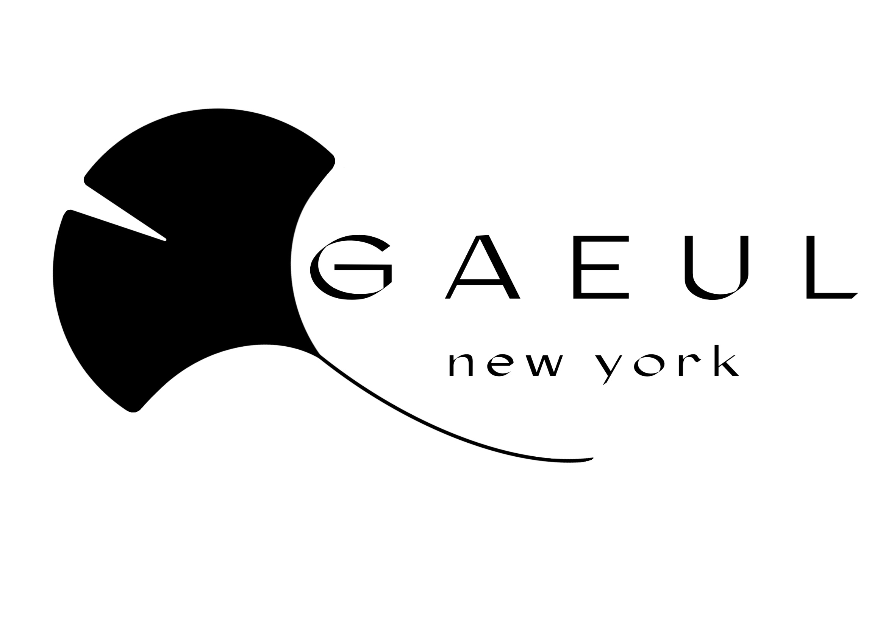

# heraldpark15.github.io
Personal Homepage



1. # gives big header
2. ## makes smaller header
3. ### makes smaller header

**makes bold face**
*makes italics*

To make a link:
[text of link in brackets](url here immediately following)

* List One
* List Two 

``` python
def binSearch(self, arr, x):
  low, high = 0, len(arr) - 1
  while low <= high:
    mid = (low + high) // 2
    if arr[mid] == x:
      return mid
    elif arr[mid] > x:
      high = mid - 1
    else:
      low = mid + 1

  return 0
```

``` python
def dfs(self, node, x):
  if not node:
    return False
  if node.val == x:
    return True
  else:
    left = dfs(node.left, x)
    right = dfs(node.right, x)
  return left or right
```
